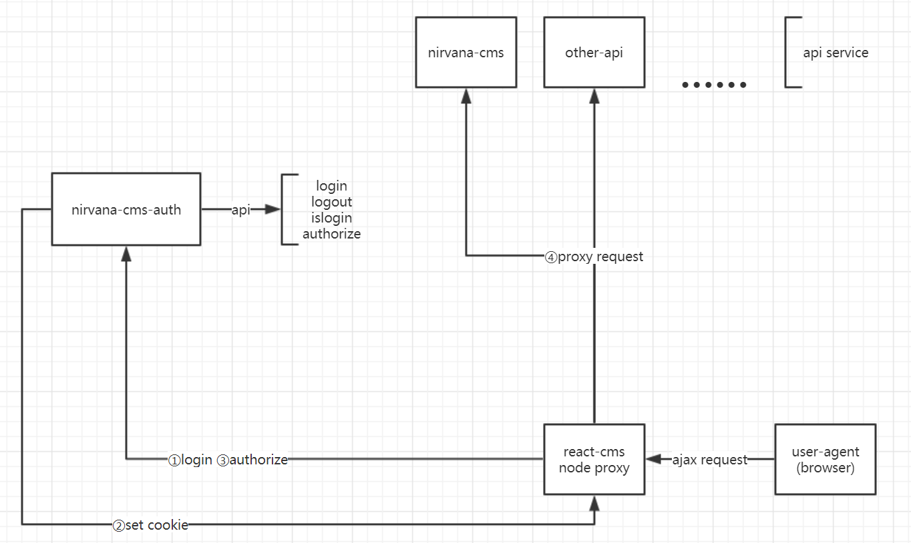

# nirvana-cms-auth
authorize api for nirvane cms.

## summary
nirvana cms is a content manager system with following features.
+ based on [nirvana](https://github.com/caicloud/nirvana), [react](https://reactjs.org/), [ant-design](https://ant.design/), [node-express](http://expressjs.com/).
+ separated architechture(frontend and backend).
+ api authorization based on url.
+ user management.
+ menu(api) management.

## usage
1. you need firstly run [nirvana-cms](https://github.com/narrowizard/nirvana-cms).
    ```shell
    # clone nirvana-cms-auth to your go src directory
    git clone https://github.com/narrowizard/nirvana-cms-auth.git
    go get
    go build
    ```
1. config project in `config/config.cfg`.
    ```config
    # mysql connection string, db address must be same with nirvana-cms project, but you can change db user(readonly in this project).  
    ConnectionString = root:123456@tcp(10.0.0.11:33061)/cms_user?charset=utf8mb4&loc=Asia%2fShanghai&parseTime=True
    # redis for session storage
    RedisConnString = {"Host":"10.0.0.11:6379","MaxIdle":10,"MaxActive":20,"IdleTimeout":60,"Wait":false,"DB":2,"Password":""}
    # session name
    SessionName = nirvana_cms_ssid
    # login session expire, measure in seconds
    LoginExpire = 1800
    ```
1. run nirvana-cms-auth `./nirvana-cms-auth` and config [react-cms](https://github.com/narrowizard/react-cms).

## architechture

there are 3 projects fundamentally.
+ nirvana-cms-auth controls user sessions and do api authorize.
+ nirvana-cms provide user and menu manager api.
+ react-cms implement api proxy refer to proxyTable.
+ your-api-service focus on your own business logic.

### login
nirvana-cms-auth check user's identity in react-cms's transponding user login request, provide authorization token to client(user-agent) if success.

### api request
there are 3 types of api in nirvana-cms.
+ `authorize api`(api from nirvana-cms-auth project). eg: login api
+ `common api`(without privilege control)
+ `other api` need to be check privilege before execute.

react-cms will transpond `authorize api` to nirvana-cms-auth project without any operating.  
As for `other api`, it will firstly request nirvana-cms-auth authorize api to check whether current user is allowed to call the specific api. After confirmation, react-cms transpond the api call to specified host(based on proxy table) with an extra `userid` parameter (detect from nirvana-cms-auth authorize api).  
> tips: nirvana-cms-auth authorize api always return true for `common api`.
